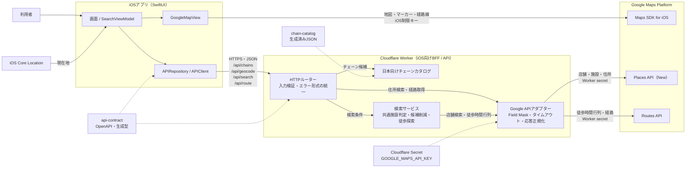
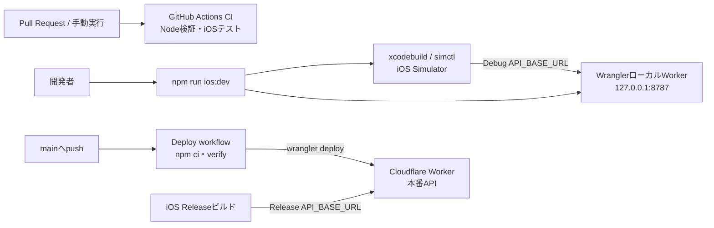

# まとめて寄れる店検索

指定した2〜5件のチェーンが同じ商業施設に入っている場所、または設定時間内に徒歩で回れる組み合わせを探す、日本国内向けのiOSアプリです。SwiftUIクライアントは、Google Maps Platformのサーバー用キーを保持するCloudflare Worker APIを利用します。

## アーキテクチャ

Cloudflare WorkerはWeb画面ではなく、iOSアプリ専用のBFF（Backend for Frontend）兼APIサーバーです。iOSアプリとGoogle Places / Routes APIの間に入り、サーバー用APIキーと検索ロジックをクライアントから分離します。地図そのものの表示はWorkerを経由せず、iOSアプリがMaps SDK for iOSを直接利用します。



### Cloudflare Workerの役割

| 責務 | 内容 |
| --- | --- |
| サーバー用キーの保護 | Places APIとRoutes API用の `GOOGLE_MAPS_API_KEY` をCloudflare Secretに保持し、iOSアプリへ配布しない |
| アプリ専用APIの提供 | Google固有のレスポンスを直接公開せず、OpenAPIで定義したアプリ向けJSONと共通エラー形式に変換する |
| 検索の組み立て | チェーンごとの店舗検索、同じ入居施設の判定、徒歩候補の絞り込み、徒歩時間行列を使った組み合わせ探索を実行する |
| 外部APIの制御 | 入力上限、Field Mask、タイムアウト、Google APIエラーの変換、同時に来た同一リクエストの集約を行う |
| チェーン候補の配信 | ビルド時に生成した日本向けチェーンカタログを `/api/chains` から返す。この処理ではGoogle APIを呼ばない |

Workerはデータベースではなく、現在はユーザー情報や検索履歴を永続化しません。また、ユーザー認証を行う仕組みもありません。Workerの公開URLはアプリ以外からも呼び出せるため、将来必要になった場合はCloudflare側のレート制限やApp Attestなどを別途検討します。

APIキーは用途ごとに分離します。

- iOS用キー: Maps SDK for iOS専用。アプリに含まれるため、Bundle ID `jp.shopoverlap.app` で制限する
- サーバー用キー: Places API（New）とRoutes API専用。Worker secretに保存し、iOSへ返さない

### 検索時のデータフロー

1. チェーン入力時は、iOSアプリが `/api/chains` を呼び、Worker内のチェーンカタログから候補を取得します。
2. 地名・住所入力時は、`/api/geocode` を通じてWorkerがPlaces APIを呼び、表示名と座標だけをアプリ向け形式で返します。
3. 検索時は、iOSアプリが選択チェーン、検索中心、半径、検索モードを `/api/search` へ送ります。
4. 「同じ施設」モードでは、WorkerがPlaces APIの入居施設情報から全チェーンに共通する施設を判定します。
5. 「徒歩で回る」モードでは、Workerが候補店舗を絞り、Routes APIの徒歩時間行列を使って制限時間内の組み合わせを求めます。
6. 徒歩結果を選ぶと `/api/route` が実経路をGeoJSONで返し、iOSアプリがMaps SDK上へ経路線を描画します。

現在地を利用した場合、その座標は検索中心としてWorkerへ送信され、店舗・経路検索のためGoogle APIへ渡されます。現在の実装ではWorkerやデータベースへ保存しません。

### 開発・デプロイ経路



GitHub Actionsが自動デプロイするのはCloudflare Workerだけです。iOSアプリの署名、TestFlight、App Store配布は現在のワークフローには含まれていません。実装上の入口は [Worker API](apps/api/src/worker.ts)、検索ユースケースは [search service](apps/api/src/services/search.ts)、API契約の正本は [OpenAPI](packages/api-contract/Sources/ShopOverlapAPI/openapi.yaml) です。

## リポジトリ構成

```text
apps/
  ios/                       SwiftUI iOSアプリ
  api/                       Cloudflare Worker API
    src/domain/              検索制約、入力検証、地理・徒歩探索ロジック
    src/services/            ユースケースの組み立て
    src/providers/google/    Places / Routes APIアダプター
    src/http/                HTTPエラー、本文、キャッシュ処理
packages/
  api-contract/              OpenAPI、生成TypeScript型、Swift Package
  chain-catalog/             日本向けチェーンカタログと生成スクリプト
```

Node側はnpm workspacesです。iOSはXcodeプロジェクトから `packages/api-contract` をローカルSwift Packageとして参照します。スクリプトは生成物の所有パッケージに置き、ルートの `package.json` はワークスペースへの委譲と検証フローだけを定義します。

## Google Cloudの準備

課金を有効にしたGoogle Cloudプロジェクトで次を有効化します。

- Maps SDK for iOS
- Places API (New)
- Routes API

用途別に2つのキーを作成してください。

- サーバー用: Places API (New) とRoutes APIだけを許可し、Worker secret `GOOGLE_MAPS_API_KEY` に登録
- iOS用: Maps SDK for iOSだけを許可し、Bundle ID `jp.shopoverlap.app`（変更する場合は設定も同期）でアプリ制限

iOS用キーはクライアントへ配布されるため、制限なしのサーバー用キーと共用しません。

## ローカル開発

Node.js 22以降とXcode 26以降を用意します。

```bash
npm install
cp apps/api/.dev.vars.example apps/api/.dev.vars
cp apps/ios/Config/Secrets.xcconfig.example apps/ios/Config/Secrets.xcconfig
```

`apps/api/.dev.vars` にサーバー用キー、`Secrets.xcconfig` にBundle ID制限済みのiOS用キーを設定します。その後、次の1コマンドでWorker起動、Simulatorの準備、ビルド、インストール、アプリ起動まで実行できます。

```bash
npm run ios:dev
```

`ios:dev` は `ShopOverlap iPhone` というiPhone 17e Simulatorを再利用し、なければ最新の互換iOSランタイム上に作成します。Workerは動作確認中そのまま稼働し、`Ctrl+C` で停止します。Workerを別ターミナルで起動済みの場合は `npm run ios:run` だけでもアプリを再ビルド・起動できます。DebugのAPI URLは既定で `http://127.0.0.1:8787` です。

本番API URLと規約ページを置く公開サイトのURLも `Secrets.xcconfig` で設定します。

Webアプリは提供しません。利用規約とプライバシーポリシーは `LEGAL_BASE_URL` 配下の `/terms` と `/privacy` に別途公開します。未設定時、iOSアプリはこれらのリンクを表示しません。

## 開発コマンド

```bash
npm run verify              # 契約・カタログ整合、型検査、Nodeテスト
npm run typecheck
npm test
npm run ios:dev             # APIとSimulatorアプリをまとめて起動
npm run ios:run             # 起動済みAPIを使ってSimulatorアプリだけ再起動
npm run ios:test
npm run contract:generate
npm run catalog:generate
```

OpenAPIを変更した場合は `npm run contract:generate` を実行し、生成されたTypeScript型も同時にコミットします。Name Suggestion Indexを更新した場合は `npm run catalog:generate` でチェーンカタログを再生成します。

## API

- `GET /api/chains?q=`: 日本向けチェーン候補
- `GET /api/geocode?q=`: 地名・住所候補
- `POST /api/search`: 半径1〜40kmの同一施設または徒歩圏検索
- `POST /api/route`: 選択した徒歩候補の経路GeoJSON

公開契約の正本は `packages/api-contract/Sources/ShopOverlapAPI/openapi.yaml` です。座標はAPI上では常に `[longitude, latitude]` の順序です。Google Places/RoutesはiOSから直接呼ばず、Workerを経由します。

## Cloudflareへのデプロイ

初回にWorker secretを登録します。

```bash
npx wrangler secret put GOOGLE_MAPS_API_KEY --config apps/api/wrangler.toml
```

`npm run api:deploy` はAPI Workerだけをデプロイします。GitHub Actionsからデプロイする場合はRepository secretsに `CLOUDFLARE_API_TOKEN` と `CLOUDFLARE_ACCOUNT_ID` を登録します。

Places APIの結果はGoogle Map上に表示し、SDKが表示するGoogle Mapsの帰属を隠しません。APIが第三者帰属を返した場合は結果付近にも表示します。
